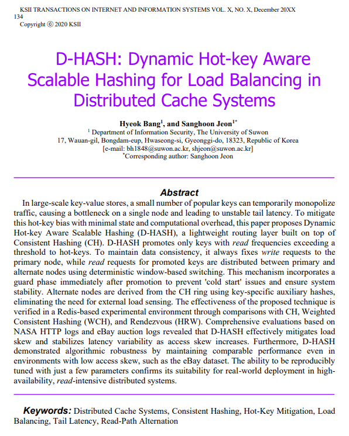

# ⚖️ D-HASH: Dynamic Hot-key Aware Scalable Hashing

> **논문 제목:** D-HASH: Dynamic Hot-key Aware Scalable Hashing for Load Balancing in Distributed Cache Systems    
> **저자:** 방혁, 전상훈 (수원대학교 정보보호학과)    
> **게재:** KSII Transactions on Internet and Information Systems (TIIS), 2026 (게재 예정)    

TIIS 2026 게재 예정 논문인 **D-HASH**의 제안 알고리즘과 실험 환경을 구현한 공식 프로젝트입니다.    
Consistent Hashing(CH) 기반의 분산 캐시 환경에서 발생하는 **Hot-key** 현상을 해결하기 위해, 런타임에 동적으로 트래픽을 분산하는 경량 라우팅 알고리즘을 제안하고 검증했습니다.

## 📋 목차
1. [개요](#1-개요)
2. [실험 설계](#2-실험-설계)
3. [실험 환경](#3-실험-환경)
4. [프로젝트 구조](#4-프로젝트-구조)
5. [실행 방법](#5-실행-방법)
6. [실험 결과](#6-실험-결과)
7. [트러블 슈팅](#7-트러블-슈팅)
8. [결론](#8-결론)

## 1. 개요

### 관련 논문
이 프로젝트는 아래 논문의 제안 알고리즘을 시뮬레이션 환경에서 구현하고, 기존 기법(CH, WCH, HRW)과 성능을 비교 검증한 결과물입니다.

*(그림: TIIS 2026에 게재된 논문 초록 및 저자 정보)*

### 실험 아키텍처
D-HASH는 기존 Consistent Hashing 링 구조 위에 '동적 핫키 감지' 및 '윈도우 기반 스위칭' 계층을 추가한 형태입니다.

> **핵심 원리:**
> 1.  **쓰기(Write):** 데이터 일관성을 위해 항상 Primary Node로 고정.
> 2.  **읽기(Read):** 평소에는 주 노드로 가지만, Hot-key로 승격되면 Primary node와 Alternate node로 트래픽을 분산.

## 2. 실험 설계

논문의 검증 논리를 코드로 구현하기 위해 다음과 같이 설계했습니다.

### 핫키 승격
- 각 키의 읽기 횟수를 모니터링하여, 임계값 T를 초과하면 Hot-key로 간주합니다.
- Guard Phase: 승격 직후 일정 기간(가드 구간) 동안은 트래픽을 분산하지 않고 주 노드로만 보내, 대체 노드의 캐시 Warm-up 시간을 보장합니다.

### 윈도우 기반 스위칭
- 가드 구간이 끝나면 윈도우 크기(W) 단위로 라우팅 경로를 교차합니다.
- 짝수 구간: 대체 노드로 분산 / 홀수 구간: 주 노드로 복귀
- 이를 통해 별도의 부하 감지 서버 없이도 두 노드 간의 트래픽을 1:1로 수렴시킵니다.

### 비교 알고리즘
- Consistent Hashing (CH): 표준 링 기반 해싱 (가상 노드 포함)
- Weighted CH (WCH): 노드 성능에 따른 가중치 적용 방식
- Rendezvous Hashing (HRW): 최고 랜덤 가중치 해싱
- Dynamic Hot-key Aware Scalable Hashing (D-HASH): 제안하는 동적 라우팅 기법

## 3. 실험 환경

- **하드웨어:** Intel Core i5-1340P, 16GB RAM, Docker (WSL2)
- **소프트웨어:** Redis 7.4.2 (라우팅 로직 검증을 위해 클러스터 모드 Off)
- **데이터셋:**
    -  NASA HTTP Logs: High Skew
    -  eBay Auction Logs: Low Skew
- **파라미터 설정:**
    - Replication Factor = 2
    - Threshold (T) = 300
    - Window (W) = 배치 크기와 동일하게 설정 (Pipeline 최적화)

## 4. 프로젝트 구조

~~~bash
dhash-routing-evaluation
├── src
│   ├── dhash_experiments
│   │   ├── algorithms.py   # 알고리즘 라우팅 로직 구현
│   │   ├── bench.py        # 벤치마크 실행 및 메트릭 측정
│   │   └── workloads.py    # Zipfian 워크로드 생성기
├── Dockerfile.runner       # Redis & Python 실행 환경
├── docker-compose.yml      # 컨테이너 오케스트레이션
└── requirements.txt        # 의존성 패키지 (mmh3, numpy, redis)
~~~

## 5. 실행 방법

### 1) 벤치마크 실행
~~~bash
# 이미지 빌드 및 시뮬레이션 시작
docker-compose up --build
~~~

### 2) 결과 확인

~~~bash
# 1. 실시간 로그 확인
docker-compose logs -f runner

# 2. 결과 파일 확인
# 각 실험 단계별로 데이터가 저장됩니다.
ls results/

# [생성 파일 예시]
# - nasa_zipf_results.csv       (zipf 실험)
# - nasa_ablation_results.csv   (파라미터 T 민감도 분석)
# - nasa_microbench_ns.csv      (라우팅 오버헤드 측정)
# - nasa_pipeline_sweep.csv     (배치 크기 최적화)
~~~

## 6. 실험 결과

### 1) NASA dataset (High Skew)
트래픽 쏠림이 심한 환경에서 D-HASH는 기본 CH 대비 부하 표준편차(Load Stddev)를 약 26.7% 감소시키며, 시스템 안정성을 크게 높였습니다.

| 알고리즘 | 처리량 (ops/s) | 평균 지연시간 (ms) | P99 지연시간 (ms) | 부하 표준편차 (낮을수록 좋음) |
| :--- | :--- | :--- | :--- | :--- |
| **CH** | 159,608 | 0.016 | 0.078 | **725,757** |
| **WCH** | 156,804 | 0.016 | 0.076 | 726,973 |
| **HRW** | 153,473 | 0.018 | 0.083 | 623,144 |
| **D-HASH** | **159,927** | **0.018** | **0.078** | **531,824** |

> **분석:** D-HASH는 핫키 트래픽을 효과적으로 분산하여, 특정 노드에 부하가 집중되는 현상을 막았습니다.

### 2) eBay dataset (Low Skew)
트래픽이 비교적 고르게 분포된 환경에서도 D-HASH는 오버헤드 없이 CH보다 높은 처리량을 기록했습니다.

| 알고리즘 | 처리량 (ops/s) | 평균 지연시간 (ms) | P99 지연시간 (ms) | 부하 표준편차 |
| :--- | :--- | :--- | :--- | :--- |
| **CH** | 183,629 | 0.015 | 0.061 | 258 |
| **D-HASH** | **193,020** | **0.015** | **0.062** | **258** |

## 7. 트러블 슈팅

### Client-side Bottleneck 해결
* **문제 상황:** 초기 Single-thread 벤치마크 시, Redis 서버의 자원은 충분함에도 처리량이 특정 구간에서 정체되는 병목 현상 발생.
* **원인 분석:** 클라이언트가 RTT를 대기하는 동안 Idle이 되어, 서버의 처리 능력을 최대로 이끌어내지 못함을 확인.
* **해결:** `bench.py`에 `ThreadPoolExecutor`를 도입하여, 멀티스레드 환경에서 비동기적으로 부하를 인가하도록 아키텍처 개선.
* **결과:** 클라이언트 병목을 해소하여 처리량을 초기 대비 약 3배 이상 향상시켰으며, 서버의 한계 성능까지 검증하는 데 성공함.

### Latency Spike 제거
* **문제 상황:** repeats 시, 후반부로 갈수록 간헐적으로 지연시간이 급격히 튀는 noise가 관측됨.
* **원인 분석:** 이전 실험 단계에서 생성된 객체가 메모리에 잔존하거나, 실험 도중 파이썬 GC가 동작하며 실행 지연을 유발.
* **해결:** `stages.py`에서 각 실험 단계 종료 시 `gc.collect()`를 명시적으로 호출하고, 난수 생성기 시드를 재설정하여 실험 환경을 격리.
* **결과:** 불규칙한 지연시간 스파이크를 제거하여, 반복 실험 간의 결과 편차를 최소화하고 재현성을 확보함.

### 라우팅 오버헤드 최적화
* **문제 상황:** 모든 요청마다 수행되는 해시 연산이 전체 응답 속도에 영향을 줄 우려가 있었음.
* **해결:** Python 기본 해시 대신 연산 속도가 빠른 `xxHash64` 알고리즘을 적용.
* **결과:** 라우팅 로직 추가에도 불구하고 기본 CH 대비 Latency 차이를 무시할 수 있는 수준으로 억제하여 오버헤드를 최소화함.

## 8. 결론

### 한계점

- 네트워크 지연이나 패킷 손실이 복잡하게 발생하는 실제 WAN/Multi-rack 환경이 아닌, Docker 기반의 단일 호스트 환경에서 검증되어 네트워크 장애 시나리오에 대한 데이터가 부족합니다.
- 현재 로직은 한 번 Hot-key로 승격되면 영원히 유지됩니다. 시간이 지나 트래픽이 식은 키(Cold key)에 대해서도 분산 라우팅을 유지하므로, 장기적으로는 캐시 지역성(Locality) 효율이 떨어질 수 있습니다.
- 다중 클라이언트 환경에서 각 클라이언트가 로컬 변수로 카운터를 관리하므로, 전체 트래픽을 합산하여 판단하는 방식보다 Hot-key 감지가 다소 지연될 수 있습니다.

### Future Work

- Time-decay function나 슬라이딩 윈도우 카운터를 도입하여, 일정 시간 동안 요청이 없으면 다시 일반 키로 강등시키는 로직을 추가할 예정입니다.
- 여러 클라이언트의 카운트 정보를 비동기적으로 취합하는 Global Counter Aggregation이나 Consistent Client-side Hashing을 도입하여 감지 정확도를 높일 계획입니다.
- 현재의 xxHash64 및 Lock 기반 구현을 넘어, SIMD 병렬 해싱이나 Lock-free 자료구조를 적용하여 동시성 처리를 극대화하는 연구를 진행할 것입니다.
